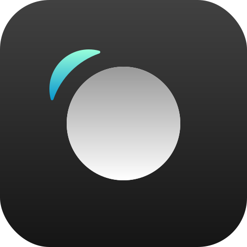

  

Welcome to <a href="https://fuse-dnoxmuzgta-lm.a.run.app" target="_blank">Cloud Video Recorder</a> , a simple yet powerful web application that allows you to record videos directly to the cloud and receive a download link via email.

## Features

- **Cloud Recording:** Record videos directly to the cloud, ensuring accessibility and reliability.
- **Offline Recording:** Even in case of a lost connection, the application records locally, automatically uploading the video once the connection is restored.
- **Email Notifications:** Receive an email with a download link once the recording is complete.
- **Timer Functionality:** Set a timer for your recording sessions.

## Stay in touch

- Author - [Ilia Lysov](https://www.linkedin.com/in/ilia-lysov/)

## Contributing

Feel free to contribute to the project by forking the repository and submitting pull requests. Any suggestions or bug reports are highly appreciated.

## License

This project is licensed under the [MIT License](LICENSE).

## Acknowledgements

Special thanks to [Google Cloud Platform](https://cloud.google.com/) for providing the infrastructure for this project.